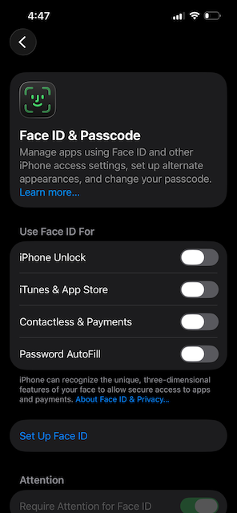

Title: How to lock down your iPhone
Date: 2026-01-15 9:14
Category: Guides
Tags: ios, security
Slug: how-to-lock-down-your-iphone
Keywords: signal, security
Authors: Colin Shevlin
Summary: A guide on locking down your iPhone for privacy. 

### Why lock down your iPhone?

If law enforcement have your phone, [it is legal for them to unlock your phone using your fingerprint or your face](https://www.wired.com/story/police-unlock-iphone-face-id-legal-rights/). However, if your phone has a numerical password on it, it is illegal for them to compel you to tell them the code access your phone. 

To me, this is absurd. Like, it should always be illegal to enter my home regardless if my door is locked. However, we live in a judicial system run by judges who don't understand technology. 

### What needs to be locked?

The most important thing is to take off your face or fingerprint for unlocking your phone. Personally, I don't even set it up when I get a new phone. That way, there's no danger of me accidentally turning it on. 

I also take some additional steps: I turn off Control Center, Siri, and Wallet from the lock screen. 

If Control Center is on, law enforcement can turn on Airplane Mode without unlocking your phone. If you are detained and you are sharing location or streaming video or recording and uploading audio, putting your phone in Airplane mode can stop those activities immediately, putting you in a more dangerous position. 

I disable Siri so that no one can as to read messages or other private data from the lock screen. I don't know exactly the threat model here, but I certainly feel better without Siri on my lock screen. 

Then Wallet is disabled because sometimes I buy too many oat milk lattes! Sue me!

